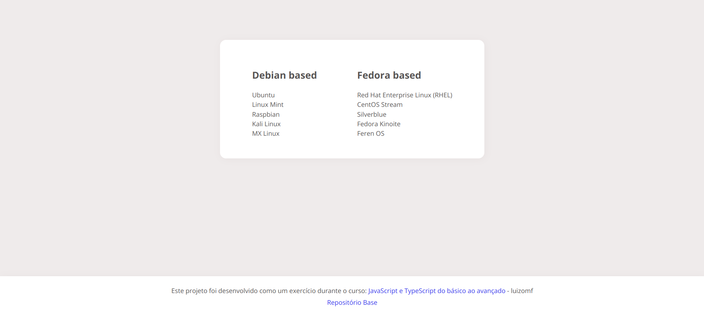

# Data and Time

⭐ Exercício de JavaScript!

Um simples projeto que adiciona uma lista de Distribuições Linux através do `for`, esse projeto foi desenvolvido como um exercício durante o curso **JavaScript e TypeScript do básico ao avançado**, do professor Luiz Otávio Miranda.

* [Ver projeto](https://alemobn.github.io/distro-list-js/)
* [Repositório Pai](https://www.github.com/alemobn/date-and-time-js)
* [Curso](https://www.udemy.com/course/curso-de-javascript-moderno-do-basico-ao-avancado/learn/lecture/16342392?start=0#overview)

Projeto desenvolvido com objetivo de praticar e entender um pouco do `for classic`.

